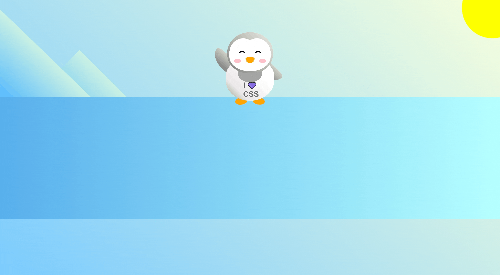

# 🐧 Penguin

A simple CSS animation that creates a stylized penguin using shapes, positioning, and layering.  
This project focuses on practicing transforms, custom shapes, and playful UI motion.

---

## ✨ Features
- 🐧 Penguin built entirely with HTML & CSS  
- 🎨 Custom shapes using borders, gradients, and positioning  
- 🎞️ Smooth motion and subtle animation  
- ❄️ Minimal, fun, and visually clean  

---

## 🛠️ Tech Stack
- **HTML5**  
- **CSS3** (animations, transforms, custom shapes)

---

## 📸 Preview  

---

## 🔧 Future Improvements  
- Add a GIF preview of the penguin animation  
- Experiment with blinking or waddling animations  
- Add a background scene (snow, ice, aurora)  

---

## 💡 What I Learned  
- How to build characters using pure CSS shapes  
- How to layer elements to create depth  
- How to add subtle motion without JavaScript  

- **[frontend practice](ca://s?q=frontend_practice_topic)**  
